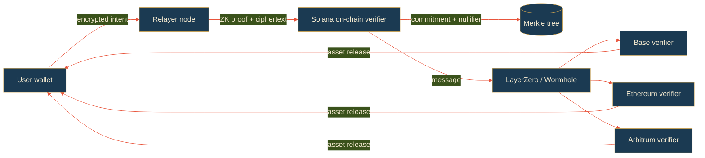

<div align="center">


# sakasu

**ZK shielded cross-chain privacy layer on Solana.**

CA: 8QA645xiDpsmmaqbk3aYeNumgNRiRDndBgjdoK61pump

[](https://github.com/sakasu-labs/sakasu/actions/workflows/ci.yml)
[](./LICENSE)
[](#)
[](#)
[](https://solana.com)
[](https://www.rust-lang.org)
[](https://www.typescriptlang.org)
[](https://sakasu.space)
[](./docs/architecture.md)
[](https://x.com/sakasu_space)

</div>

---

## What it is

Sakasu is a privacy layer designed for Solana ↔ EVM cross-chain swaps.
Once the full stack ships, users will move USDC / SOL / ETH between Solana,
Base, Ethereum and Arbitrum without leaving an on-chain trail of who they
are, where the funds came from, or what their next move is.

Behind the noren, no one sees what you carry.

## Status — what is actually live today

This repository documents the full target architecture. Not all of it is
operational yet. The current release is **v0**, and the boundary between
"shipped" and "roadmap" is recorded explicitly so the codebase can be
audited against this claim:

**Live on Solana mainnet (v0):**

- `sakasu-vault` Anchor program: `HXXFgjuzwhNzk4EfGf6pWNE5hapV5FYN2ZRSwchcMy8p`
- Five on-chain instructions: `initialize_vault`, `commit_transfer`,
  `relayer_redeem`, `register_relayer`, `unstake_relayer`
- VaultConfig PDA initialized with fee_bps = 30 (0.30%)
- Commitment + nullifier set enforcing single-redemption invariants
- Staking ledger for relayer registration
- Token-2022 compatible vault path via `anchor-spl::token_interface`

**Not yet in the v0 build (roadmap — see [ROADMAP.md](./ROADMAP.md)):**

- The on-chain ZK proof verifier itself. v0 enforces commitment existence
  and nullifier freshness; the SNARK proof check ships in v1.x via Light
  Protocol integration (target: 1–4 weeks post-launch).
- A complete relayer P2P network. The current relayer crate ships a
  functioning HTTP node skeleton; full peer discovery, encrypted intent
  decryption, and slashing automation are tracked for v1.x.
- Destination-chain verifier contracts (Base / Ethereum / Arbitrum). Ships
  with v1.x alongside the audited Solana mainnet program upgrade.
- X25519 + ChaCha20-Poly1305 intent encryption. v0 SDK uses a base64
  placeholder so the rest of the stack can be exercised end-to-end. The
  real envelope encryption lands in `@sakasu/sdk` v0.3.

Every claim in this document is checkable: the mainnet program ID above
opens on Solscan, the CI is in `.github/workflows/`, and the roadmap items
are tracked as open issues in this repository.

### Live mainnet evidence

The full vault lifecycle was exercised on Solana mainnet on 2026-05-18.
Each of the four protocol instructions left an on-chain transaction that
anyone can replay through Solscan:

- `commit_transfer` — [4FJfKHUm...wahF9k](https://solscan.io/tx/4FJfKHUmxxbz7n16Hm1YUw86zR56A7xwTwXQ2gMQoVDPxGKe4C2De5QoHJ1YXnWuZTPFR87KibvLCydqS7wahF9k)
- `register_relayer` — [5E8wRw1m...rLS1u](https://solscan.io/tx/5E8wRw1mSQcbrq2vATYKZihAdmU7KztbjeHyuyZE5oUSFhVW8DkpYeWacSw7niHhVjbBEWJM9Wp94MignhFrLS1u)
- `relayer_redeem` — [2KFyaM7B...gV7](https://solscan.io/tx/2KFyaM7BsaURXEwibj9oAHrzYm8PGHq6PUAr438Bsijb9vMtSRPuJ3WvQdx8T4r94yT4zf6hheDS6aYUog2GyV7)
- `unstake_relayer` — [37BsxCSj...FB3](https://solscan.io/tx/37BsxCSjwQoiX9SQtygRb5nsJFcmUFWmiWqJK3b4hhvnWSFLBrz7Dv3VsfFzFfKgAJ8S5KQvMCo1CVLy6FQUCFB3)

### v1.0 — Groth16 verifier live on mainnet (2026-05-18)

The on-chain Groth16 verifier described in `zk/circuits/commitment_proof.circom`
is now live in the Solana mainnet program. `commit_transfer` accepts an
optional proof argument and, when supplied, runs the BN-254 pairing check
through Solana's native `alt_bn128_pairing` syscall before recording the
commitment.

- Program upgrade adding the verifier — [59x8dNfY...B6gpw](https://solscan.io/tx/59x8dNfYRPSBgS2XQeC72MtwBVhKffEocMHHtPLJ3pKgjcG1WDXwBhc9GPJn6u9tQ5EVT8g6bdghpBDSDfPB6gpw)
- Program upgrade enabling relayer reactivation — [2uwk51GC...Kf4f](https://solscan.io/tx/2uwk51GCLuSff81rDuoSUWjQN9vi37Z4JKv9fyNj3h7tUpx3ZBRfXmCtasF3c7R7CZnnigjkuzD2AGkRmixxKf4f)
- First `commit_transfer` accepted with a real Groth16 proof — [3KjW7Jyr...ddK2](https://solscan.io/tx/3KjW7JyrzE79GJi8LhXxisuCsfggaXJb7EzY2gUQHBwBmMTzadW8uMnxtttsjSyS5Y6sYMmpBEmKdAiVuT55ddK2)

That third transaction is the receipt that the on-chain BN-254 pairing
check ran on a proof produced by the circom circuit in this repository.
Anyone with `solana-cli` and the proving key shipped in `zk/build/` can
generate a new proof and submit their own `commit_transfer` against
program `HXXFgjuzwhNzk4EfGf6pWNE5hapV5FYN2ZRSwchcMy8p`.

The full reproduction script is `chain/migrations/demo_e2e_zk_mainnet.ts`
in the private deployment repo; the public source for the verifier
itself is at `zk/circuits/commitment_proof.circom` and the verification
key is committed at `zk/build/verification_key.json` (the same bytes are
embedded in the on-chain program's `verifying_key.rs`).

## Architecture



The user submits an encrypted intent (asset, amount, destination) to a relayer.
The relayer builds a ZK proof showing the intent is well-formed, posts it
on-chain on Solana with a fresh commitment, and asynchronously triggers the
destination chain verifier through a cross-chain messaging bridge.

## Repository layout

```
crates/
  core/              # shared primitives — commitment / nullifier / transfer / merkle
  relayer/           # relayer daemon (Rust) — networking + staking
sdk/                 # TypeScript SDK for browser + Node.js
docs/                # architecture, circuit notes, relayer economics, security
.github/             # CI, issue templates, PR template
```

## Quickstart

### TypeScript SDK

```ts
import { SakasuClient } from "@sakasu/sdk"

const client = new SakasuClient({ endpoint: "https://api.sakasu.space" })

const intent = await client.buildShieldedTransfer({
  fromChain: "solana",
  toChain: "base",
  asset: "USDC",
  amount: 250_000_000n,
})

const receipt = await client.submitIntent(intent)
console.log(receipt.commitmentHash)
```

### Rust core

```rust
use sakasu_core::Commitment;

let view_key = [7u8; 32];
let c = Commitment::build(101, "USDC", 250_000_000, &view_key).unwrap();
println!("commitment = {}", hex::encode(c.as_bytes()));
```

### Relayer daemon

```bash
cargo run -p sakasu-relayer -- \
    --listen 0.0.0.0:7780 \
    --solana-rpc https://api.mainnet-beta.solana.com
```

## Supported chains

| Chain     | Status       |
|-----------|--------------|
| Solana    | mainnet beta |
| Base      | testnet      |
| Ethereum  | testnet      |
| Arbitrum  | planned      |

## Staking and fees

The relayer network is permissionless but staked. To register a relayer node,
operators lock at least 10,000 $SKS. Each shielded transfer pays a fee in the
source-chain asset; that fee splits 50% to the relayer, 50% to $SKS
buyback-and-burn.

See [`docs/relayer-economics.md`](./docs/relayer-economics.md).

## Security model

Sakasu's privacy guarantees rest on the soundness of the zk-SNARK circuit and
the integrity of the Merkle tree update path. The implementation is awaiting
third-party review. Do not use mainnet funds you cannot afford to lose.

For threat modelling, see [`docs/security-model.md`](./docs/security-model.md).

## Contributing

We welcome bug reports, audit notes, and SDK contributions. Open an issue
before sending a PR for any non-trivial change. See `CONTRIBUTING.md`.

## License

MIT. See [LICENSE](./LICENSE).

## Links

- Site — https://sakasu.space
- API — https://api.sakasu.space
- Docs — [`docs/architecture.md`](./docs/architecture.md)
- X / Twitter — [@sakasu_space](https://x.com/sakasu_space)


