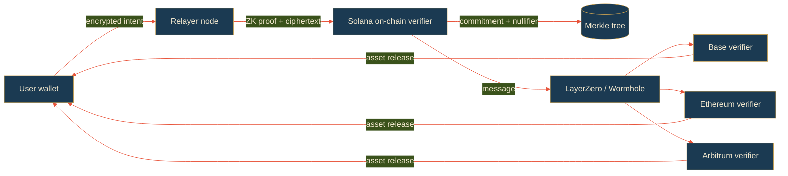

<div align="center">


# sakasu

**ZK shielded cross-chain privacy layer on Solana.**

[](https://github.com/sakasu-labs/sakasu/actions/workflows/ci.yml)
[](./LICENSE)
[](#)
[](#)
[](https://solana.com)
[](https://www.rust-lang.org)
[](https://www.typescriptlang.org)
[](https://sakasu.space)
[](./docs/architecture.md)
[](https://x.com/sakasu_space)

</div>

---

## What it is

Sakasu is a privacy layer for Solana ↔ EVM cross-chain swaps. Built around
zk-SNARK shielded commitments, encrypted intent submission, and a staked
relayer network, it lets users move USDC / SOL / ETH between Solana, Base,
Ethereum and Arbitrum without leaving an on-chain trail of who they are,
where the funds came from, or what their next move is.

Behind the noren, no one sees what you carry.

## Architecture



The user submits an encrypted intent (asset, amount, destination) to a relayer.
The relayer builds a ZK proof showing the intent is well-formed, posts it
on-chain on Solana with a fresh commitment, and asynchronously triggers the
destination chain verifier through a cross-chain messaging bridge.

## Repository layout

```
crates/
  core/              # shared primitives — commitment / nullifier / transfer / merkle
  relayer/           # relayer daemon (Rust) — networking + staking
sdk/                 # TypeScript SDK for browser + Node.js
docs/                # architecture, circuit notes, relayer economics, security
.github/             # CI, issue templates, PR template
```

## Quickstart

### TypeScript SDK

```ts
import { SakasuClient } from "@sakasu/sdk"

const client = new SakasuClient({ endpoint: "https://api.sakasu.space" })

const intent = await client.buildShieldedTransfer({
  fromChain: "solana",
  toChain: "base",
  asset: "USDC",
  amount: 250_000_000n,
})

const receipt = await client.submitIntent(intent)
console.log(receipt.commitmentHash)
```

### Rust core

```rust
use sakasu_core::Commitment;

let view_key = [7u8; 32];
let c = Commitment::build(101, "USDC", 250_000_000, &view_key).unwrap();
println!("commitment = {}", hex::encode(c.as_bytes()));
```

### Relayer daemon

```bash
cargo run -p sakasu-relayer -- \
    --listen 0.0.0.0:7780 \
    --solana-rpc https://api.mainnet-beta.solana.com
```

## Supported chains

| Chain     | Status       |
|-----------|--------------|
| Solana    | mainnet beta |
| Base      | testnet      |
| Ethereum  | testnet      |
| Arbitrum  | planned      |

## Staking and fees

The relayer network is permissionless but staked. To register a relayer node,
operators lock at least 10,000 $SAKA. Each shielded transfer pays a fee in the
source-chain asset; that fee splits 50% to the relayer, 50% to $SAKA
buyback-and-burn.

See [`docs/relayer-economics.md`](./docs/relayer-economics.md).

## Security model

Sakasu's privacy guarantees rest on the soundness of the zk-SNARK circuit and
the integrity of the Merkle tree update path. The implementation is awaiting
third-party review. Do not use mainnet funds you cannot afford to lose.

For threat modelling, see [`docs/security-model.md`](./docs/security-model.md).

## Contributing

We welcome bug reports, audit notes, and SDK contributions. Open an issue
before sending a PR for any non-trivial change. See `CONTRIBUTING.md`.

## License

MIT. See [LICENSE](./LICENSE).

## Links

- Site — https://sakasu.space
- API — https://api.sakasu.space
- Docs — [`docs/architecture.md`](./docs/architecture.md)
- X / Twitter — [@sakasu_space](https://x.com/sakasu_space)

<!-- rev-s4ek1y -->

<!-- rev-7f5afu -->

<!-- rev-3pfnd4 -->

<!-- rev-qeula5 -->

<!-- rev-oa2yyi -->

<!-- rev-3qqne9 -->

<!-- rev-7lltof -->

<!-- rev-t9djbp -->

<!-- rev-d0ys2u -->

<!-- rev-vhvqgw -->

<!-- rev-8e35tn -->

<!-- rev-li1nep -->

<!-- rev-azemr7 -->

<!-- rev-5u2n51 -->

<!-- rev-aeqihe -->
